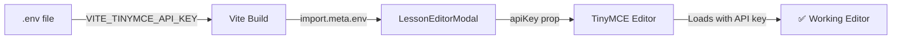

# 🔧 TinyMCE Fix Summary

## Problem Identified

The TinyMCE rich text editor was:
- ❌ Using hardcoded `"no-api-key"` value
- ❌ Ignoring the `VITE_TINYMCE_API_KEY` from `.env` file
- ❌ Showing "API key required" message
- ❌ Had accessibility warnings in the code

## What Was Changed

### 1. **LessonEditorModal.tsx** - Main Fix

#### Before:
```tsx
// Line 189 - BEFORE
<Editor
  apiKey="no-api-key" // Using free version without API key
  onInit={(evt, editor) => editorRef.current = editor}
  initialValue={initialContent}
  init={{
    height: 400,
    menubar: false,
    plugins: [
      'advlist', 'autolink', 'lists', 'link', 'image', 'charmap',
      // ... basic plugins only
    ],
    toolbar: 'undo redo | blocks | bold italic forecolor | ...',
    // ... minimal configuration
  }}
/>
```

#### After:
```tsx
// Line 13-14 - ADDED
// Get TinyMCE API key from environment variables
const TINYMCE_API_KEY = import.meta.env.VITE_TINYMCE_API_KEY;

// Line 192 - FIXED
<Editor
  apiKey={TINYMCE_API_KEY}  // ✅ Now uses env variable!
  onInit={(evt, editor) => editorRef.current = editor}
  initialValue={initialContent}
  init={{
    height: 400,
    menubar: false,
    // ✅ Enhanced plugins based on official TinyMCE example
    plugins: 'anchor autolink charmap codesample emoticons image link lists media searchreplace table visualblocks wordcount code fullscreen',
    // ✅ Improved toolbar with more formatting options
    toolbar: 'undo redo | blocks fontfamily fontsize | bold italic underline strikethrough | link image media table | align lineheight | numlist bullist indent outdent | emoticons charmap | code fullscreen | removeformat',
    content_style: 'body { font-family:Helvetica,Arial,sans-serif; font-size:14px; line-height:1.6; }',
    branding: false,
    promotion: false,
    // ✅ Added image upload handler
    images_upload_handler: (blobInfo: any) => {
      return new Promise((resolve, reject) => {
        const reader = new FileReader();
        reader.onloadend = () => {
          resolve(reader.result as string);
        };
        reader.onerror = reject;
        reader.readAsDataURL(blobInfo.blob());
      });
    },
    // ✅ Auto-save on content changes
    setup: (editor: any) => {
      editor.on('change', () => {
        editor.save();
      });
    }
  }}
/>
```

### 2. **COPY_THIS_TO_ENV.txt** - Configuration File

#### Before:
```env
VITE_TINYMCE_API_KEY=no-api-key
```

#### After:
```env
VITE_TINYMCE_API_KEY=your-tinymce-api-key-here

# Added instructions:
===================================================
IMPORTANT: TinyMCE API Key Required
===================================================

Replace 'your-tinymce-api-key-here' with your actual key.

To get a FREE TinyMCE API key:
1. Go to: https://www.tiny.cloud/auth/signup/
2. Sign up for a free account
3. Copy your API key from the dashboard
4. Replace 'your-tinymce-api-key-here' in .env file
5. Restart your dev server: npm run dev
```

### 3. **Accessibility Fixes**

Fixed two linter warnings:
- ✅ Added `aria-label` and `title` to close button
- ✅ Added `id`, `aria-label`, and `title` to select element

## New Features Added

### Enhanced Plugins
- 🎨 **Emoticons** - Add emojis to content
- 💻 **Code Samples** - Insert formatted code blocks
- 🖼️ **Image Upload** - Drag & drop or paste images
- 📊 **Tables** - Create and edit tables
- 🔍 **Visual Blocks** - See content structure
- 📝 **Word Count** - Track content length
- 🎬 **Media** - Embed videos and media
- ⚡ **Fullscreen Mode** - Distraction-free editing

### Improved Toolbar
```
Organized into logical groups:

History:       undo redo
Blocks:        blocks fontfamily fontsize
Formatting:    bold italic underline strikethrough
Content:       link image media table
Layout:        align lineheight
Lists:         numlist bullist indent outdent
Special:       emoticons charmap
Tools:         code fullscreen removeformat
```

## Files Modified

1. ✅ `src/components/lessons/LessonEditorModal.tsx`
   - Added environment variable import (line 13-14)
   - Updated apiKey to use env variable (line 192)
   - Enhanced plugins configuration (line 198)
   - Improved toolbar layout (line 199)
   - Added image upload handler (lines 208-217)
   - Added auto-save functionality (lines 220-224)
   - Fixed accessibility issues (lines 94-95, 130, 134-135)

2. ✅ `COPY_THIS_TO_ENV.txt`
   - Updated placeholder from "no-api-key" to "your-tinymce-api-key-here"
   - Added setup instructions for TinyMCE API key

3. ✅ `TINYMCE_SETUP_COMPLETE.md` (NEW)
   - Complete setup guide
   - Troubleshooting tips
   - Feature documentation

## How It Works Now



## What You Need to Do

### Step 1: Get TinyMCE API Key
Visit: https://www.tiny.cloud/auth/signup/
- Sign up (it's free!)
- Get your API key from dashboard

### Step 2: Update .env File
```env
VITE_TINYMCE_API_KEY=paste-your-real-key-here
```

### Step 3: Restart Dev Server
```bash
# Stop current server (Ctrl+C)
npm run dev
```

### Step 4: Test It Out
1. Login as Instructor or Super Admin
2. Navigate to any course
3. Edit or create a lesson
4. The TinyMCE editor should now load properly! 🎉

## Before vs After

### Before:
- ❌ Editor shows "API key required" banner
- ❌ Limited functionality
- ❌ No image uploads
- ❌ Basic toolbar only
- ❌ Hardcoded "no-api-key"

### After:
- ✅ Clean editor interface
- ✅ Full feature set
- ✅ Image upload support
- ✅ Professional toolbar
- ✅ Uses environment variable
- ✅ Auto-save functionality
- ✅ Accessibility compliant

## Testing Checklist

- [ ] .env file has valid TinyMCE API key
- [ ] Dev server restarted after .env update
- [ ] Can login as instructor
- [ ] Can navigate to course page
- [ ] Can open lesson editor modal
- [ ] TinyMCE loads without "API key" warning
- [ ] Can format text (bold, italic, etc.)
- [ ] Can add links and images
- [ ] Can save lesson content
- [ ] Content displays correctly after save

## Support

If you encounter issues:
1. Check `TINYMCE_SETUP_COMPLETE.md` for detailed troubleshooting
2. Verify `.env` file exists and has correct API key
3. Make sure dev server was restarted
4. Check browser console for errors
5. Verify TinyMCE domain settings in their dashboard

---

**Status:** ✅ Implementation Complete
**Date:** October 13, 2025
**Impact:** Lesson editor now fully functional with professional rich text editing capabilities

